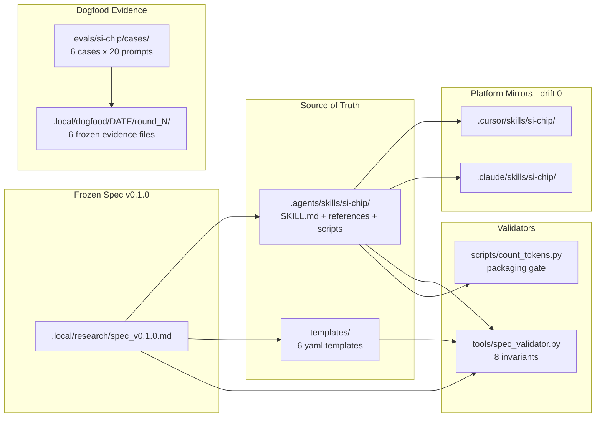

# Si-Chip

> Persistent BasicAbility optimization factory.


- Spec: [`.local/research/spec_v0.1.0.md`](./.local/research/spec_v0.1.0.md)
- Ship report: [`.local/dogfood/2026-04-28/v0.1.0_ship_report.md`](./.local/dogfood/2026-04-28/v0.1.0_ship_report.md)
- User guide: [`USERGUIDE.md`](./USERGUIDE.md) · Install: [`INSTALL.md`](./INSTALL.md) · Changelog: [`CHANGELOG.md`](./CHANGELOG.md)
- Demo / docs site: https://yorha-agents.github.io/Si-Chip/

## What Is Si-Chip

Si-Chip is a persistent `BasicAbility` optimization factory. The `BasicAbility`
is the first-class object; Si-Chip optimizes it through metric-driven dogfood
loops (`profile -> evaluate -> diagnose -> improve -> router-test ->
half-retire-review -> iterate -> package-register`). Every round must drop
machine-readable evidence so the next round can compute deltas. Si-Chip ships
as its own first user: the v0.1.0 release proves the loop on Si-Chip itself
before the loop is offered to any other ability (spec v0.1.0 §1.1, §8.3).

## Quick Install

```bash
curl -fsSL https://yorha-agents.github.io/Si-Chip/install.sh | bash
```

The interactive installer asks you which target (Cursor, Claude Code, or both) and which scope (global = `~/.cursor/skills/si-chip/`, or repo = `<repo>/.cursor/skills/si-chip/`).

For non-interactive installs and the full flag reference, see [`INSTALL.md`](./INSTALL.md#quick-install-one-line).

## Quick Start (after install or clone)

```bash
# 1. Validate the frozen spec invariants (run from the repo root)
python tools/spec_validator.py --json

# 2. Re-aggregate baseline metrics from the included simulated runs
python .agents/skills/si-chip/scripts/aggregate_eval.py \
  --runs-dir evals/si-chip/baselines/with_si_chip \
  --baseline-dir evals/si-chip/baselines/no_ability \
  --skill-md .agents/skills/si-chip/SKILL.md \
  --templates-dir templates \
  --out /tmp/metrics_report.yaml

# 3. Confirm the SKILL.md packaging gate
python .agents/skills/si-chip/scripts/count_tokens.py \
  --file .agents/skills/si-chip/SKILL.md --both \
  --budget-meta 100 --budget-body 5000 --json
```

The first command exits 0 with `verdict: PASS` (8/8 spec invariants). The second produces a metrics_report.yaml with the MVP-8 metrics populated (T1=0.85, T2=0.55, T3=+0.35, ...). The third confirms the SKILL.md fits the v3_strict packaging budget (metadata=78, body=2020, pass=true).

## Headline Numbers (v0.1.0)

| Metric | Round 1 | Round 2 | v1_baseline gate |
|---|---|---|---|
| pass_rate | 0.85 | 0.85 | >= 0.75 PASS |
| trigger_F1 | 0.89 | 0.89 | >= 0.80 PASS |
| metadata_tokens | 78 | 78 | <= 120 PASS |
| per_invocation_footprint | 4071 | 3598 (-11.6%) | <= 9000 PASS |
| wall_clock_p95 (s) | 1.47 | 1.47 | <= 45 PASS |
| half_retire decision | keep | keep | numeric value vector |
| router_floor | composer_2/default | composer_2/default | spec §5.3 |

Source: `.local/dogfood/2026-04-28/v0.1.0_ship_report.md` (S8 final-validate).

## Architecture



## Repository Layout

```
.agents/skills/si-chip/    canonical Skill source-of-truth
.cursor/skills/si-chip/    Cursor mirror (drift 0)
.claude/skills/si-chip/    Claude Code mirror (drift 0)
.cursor/rules/             Cursor bridge rule
.rules/                    rule layer compiled into AGENTS.md
templates/                 6 frozen factory yaml templates
evals/si-chip/             cases, runners, baselines, smoke report
tools/                     spec_validator.py + DESIGN
docs/                      GitHub Pages site
.local/research/           frozen spec + R1-R10 evidence library
.local/dogfood/            per-round evidence (basic_ability_profile,
                           metrics_report, router_floor_report,
                           half_retire_decision, next_action_plan,
                           iteration_delta_report)
AGENTS.md                  compiled rules consumed by Cursor / Codex /
                           Claude / Copilot
```

## Documentation Index

- Skill body: [`.agents/skills/si-chip/SKILL.md`](./.agents/skills/si-chip/SKILL.md)
- References (loaded on demand, excluded from §7.3 SKILL.md body budget):
  - [`basic-ability-profile.md`](./.agents/skills/si-chip/references/basic-ability-profile.md)
  - [`self-dogfood-protocol.md`](./.agents/skills/si-chip/references/self-dogfood-protocol.md)
  - [`metrics-r6-summary.md`](./.agents/skills/si-chip/references/metrics-r6-summary.md)
  - [`router-test-r8-summary.md`](./.agents/skills/si-chip/references/router-test-r8-summary.md)
  - [`half-retirement-r9-summary.md`](./.agents/skills/si-chip/references/half-retirement-r9-summary.md)
- Templates (machine-readable, parsed by DevolaFlow `template_engine`):
  - [`basic_ability_profile.schema.yaml`](./templates/basic_ability_profile.schema.yaml)
  - [`self_eval_suite.template.yaml`](./templates/self_eval_suite.template.yaml)
  - [`router_test_matrix.template.yaml`](./templates/router_test_matrix.template.yaml)
  - [`half_retire_decision.template.yaml`](./templates/half_retire_decision.template.yaml)
  - [`next_action_plan.template.yaml`](./templates/next_action_plan.template.yaml)
  - [`iteration_delta_report.template.yaml`](./templates/iteration_delta_report.template.yaml)
- Demo / docs site: https://yorha-agents.github.io/Si-Chip/
- Install paths: [`INSTALL.md`](./INSTALL.md)
- User guide: [`USERGUIDE.md`](./USERGUIDE.md)
- Changelog: [`CHANGELOG.md`](./CHANGELOG.md)
- Contributing: [`CONTRIBUTING.md`](./CONTRIBUTING.md)

## Out of Scope

Forever-out per spec §11.1:

- Skill / Plugin marketplace and any distribution surface.
- Router model training or online weight learning.
- Generic IDE / Agent runtime compatibility layer.
- Markdown-to-CLI auto-converter.

Deferred per spec §11.2 (re-evaluable in a later spec bump):

- Codex native SKILL.md runtime support (v0.x is bridge-only).
- Plugin distribution (commands / hooks / marketplace upgrades).
- Broader IDE coverage (OpenCode / Copilot CLI / Gemini CLI / etc.).
- Multi-tenant hosted API surface.

Pull requests that introduce any §11.1 item will be closed without review.

## License

Apache-2.0. See [LICENSE](./LICENSE).
