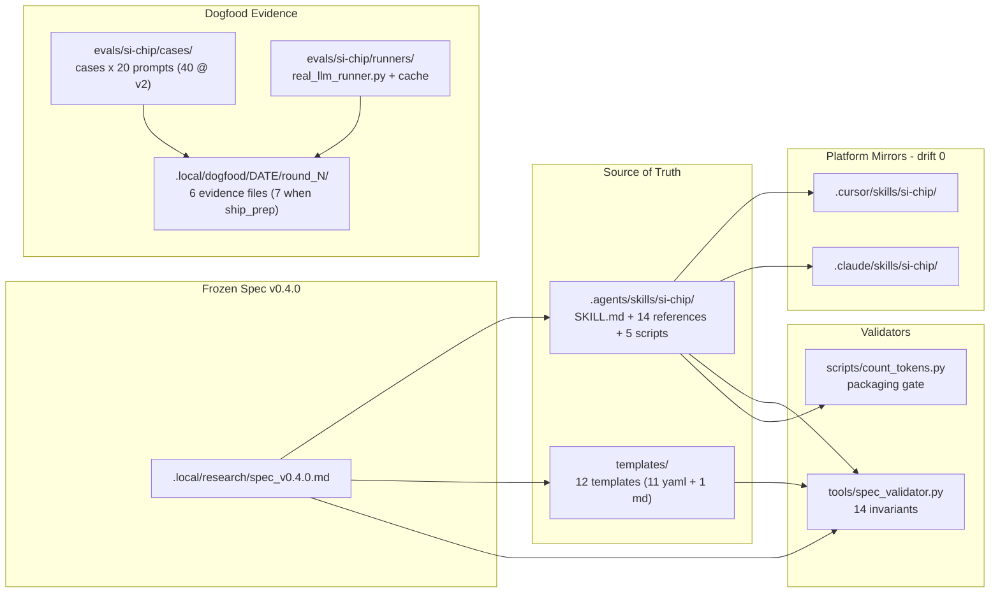

# Si-Chip

> Persistent BasicAbility optimization factory.


- Spec: [`.local/research/spec_v0.4.0.md`](./.local/research/spec_v0.4.0.md)
- Ship report: [`.local/dogfood/2026-04-30/v0.4.0_ship_report.md`](./.local/dogfood/2026-04-30/v0.4.0_ship_report.md)
- User guide: [`USERGUIDE.md`](./USERGUIDE.md) · Install: [`INSTALL.md`](./INSTALL.md) · Changelog: [`CHANGELOG.md`](./CHANGELOG.md)
- Demo / docs site: https://yorha-agents.github.io/Si-Chip/

## What Is Si-Chip

Si-Chip is a persistent `BasicAbility` optimization factory. The `BasicAbility`
is the first-class object; Si-Chip optimizes it through metric-driven dogfood
loops (`profile -> evaluate -> diagnose -> improve -> router-test ->
half-retire-review -> iterate -> package-register`). Every round must drop
machine-readable evidence so the next round can compute deltas. Si-Chip ships
as its own first user: every release proves the loop on Si-Chip itself
before the loop is offered to any other ability (spec v0.4.0 §1.1, §8.3).
v0.4.0 is the **first release shipped at the `v2_tightened` (= `standard`)
gate** after 19 consecutive `v1_baseline` rounds and 2 consecutive
`v2_tightened` rounds (Round 18 + Round 19), with the new
`evals/si-chip/runners/real_llm_runner.py` unblocking honest k=4 sampling
against `claude-haiku-4-5` + `claude-sonnet-4-6`.

## Quick Install

```bash
curl -fsSL https://yorha-agents.github.io/Si-Chip/install.sh | bash
```

The interactive installer asks you which target (Cursor, Claude Code, or both) and which scope (global = `~/.cursor/skills/si-chip/`, or repo = `<repo>/.cursor/skills/si-chip/`).

For non-interactive installs and the full flag reference, see [`INSTALL.md`](./INSTALL.md#quick-install-one-line).

## Quick Start (after install or clone)

```bash
# 1. Validate the frozen spec invariants (run from the repo root)
python tools/spec_validator.py --json

# 2. Re-aggregate baseline metrics from the included simulated runs
python .agents/skills/si-chip/scripts/aggregate_eval.py \
  --runs-dir evals/si-chip/baselines/with_si_chip \
  --baseline-dir evals/si-chip/baselines/no_ability \
  --skill-md .agents/skills/si-chip/SKILL.md \
  --templates-dir templates \
  --out /tmp/metrics_report.yaml

# 3. Confirm the SKILL.md packaging gate
python .agents/skills/si-chip/scripts/count_tokens.py \
  --file .agents/skills/si-chip/SKILL.md --both \
  --budget-meta 100 --budget-body 5000 --json
```

The first command exits 0 with `verdict: PASS` (14/14 spec invariants). The second produces a metrics_report.yaml whose v0.4.0 Round 19 values are populated against the real-LLM cache (T1=1.0 best cell, T2=1.0 best cell, T3=+0.95, ...); the deterministic baseline runners under `evals/si-chip/runners/{no_ability_runner,with_ability_runner}.py` are still simulator-based, while the real-LLM cache lives at `.local/dogfood/2026-04-30/round_18/raw/real_llm_runner_cache/` (640 entries; cache replay at $0). The third confirms the SKILL.md fits the v2_tightened packaging budget (metadata=94, body=4646, pass=true; v3_strict metadata budget ≤ 80 is deferred to v0.4.x).

## Headline Numbers (v0.4.0)

| Metric | Round 18 | Round 19 | v2_tightened gate |
|---|---|---|---|
| pass_rate | 1.0 best cell, 0.9719 mean | same (cache replay) | >= 0.82 PASS |
| T2_pass_k | 1.0 best cell | same (cache replay) | >= 0.55 PASS |
| trigger_F1 | 1.0 | 1.0 | >= 0.85 PASS |
| near_miss_FP_rate | 0.0 | 0.0 | <= 0.10 PASS |
| metadata_tokens | 94 (Stage 8 frozen) | 94 | <= 100 PASS |
| per_invocation_footprint | 4726 | 4726 | <= 7000 PASS |
| wall_clock_p95 (s) | 17.0028 | 17.5726 | <= 30 PASS |
| routing_latency_p95 (ms) | 0.16 | 0.16 | <= 1200 PASS |
| routing_token_overhead | 0.0233 | 0.0233 | <= 0.12 PASS |
| iteration_delta | +0.4522 task_quality | task_delta value 0.95 | >= +0.10 PASS |

Source: `.local/dogfood/2026-04-30/v0.4.0_ship_report.md` (Stage 8 ship-prep).
Round 18 was the first dogfood-side `real_llm_runner.py` invocation
($0.20 spend; 640 calls; 16-min wall-clock); Round 19 replayed the cache
at 100% hit ($0; ~20 ms wall-clock).

## Architecture



## Repository Layout

```
.agents/skills/si-chip/    canonical Skill source-of-truth (1 SKILL.md +
                           1 DESIGN.md + 14 references + 5 scripts = 21
                           files; tarball includes DESIGN.md = 21 files
                           identical to the source-of-truth)
.cursor/skills/si-chip/    Cursor mirror (20 files; no DESIGN.md; drift 0)
.claude/skills/si-chip/    Claude Code mirror (20 files; no DESIGN.md;
                           drift 0)
.cursor/rules/             Cursor bridge rule
.rules/                    rule layer compiled into AGENTS.md (13 rules)
templates/                 12 frozen factory templates (11 yaml + 1 md
                           checklist)
evals/si-chip/             cases, baselines, smoke report;
                           runners/no_ability_runner.py +
                           runners/with_ability_runner.py (deterministic
                           seeded simulators) plus
                           runners/real_llm_runner.py (real-LLM evaluator
                           that unblocks T2_pass_k via Anthropic Messages
                           API)
tools/                     spec_validator.py (14 BLOCKERs) +
                           health_smoke.py + method_tag_validator.py +
                           DESIGN
docs/                      GitHub Pages site (release tarballs under
                           docs/skills/)
.local/research/           frozen spec (v0.4.0 active; v0.1.0 / v0.2.0 /
                           v0.3.0 retained as pinned snapshots) +
                           R1-R12.5 evidence library
.local/dogfood/            per-round evidence (basic_ability_profile,
                           metrics_report, router_floor_report,
                           half_retire_decision, next_action_plan,
                           iteration_delta_report; ship_decision when
                           round_kind == ship_prep) plus
                           raw/real_llm_runner_cache/ when the real-LLM
                           runner has been invoked
AGENTS.md                  compiled rules consumed by Cursor / Codex /
                           Claude / Copilot (13 hard rules at v0.4.0)
```

## Documentation Index

- Skill body: [`.agents/skills/si-chip/SKILL.md`](./.agents/skills/si-chip/SKILL.md)
- References (loaded on demand, excluded from §7.3 SKILL.md body budget;
  5 originals + 3 added @v0.3.0 + 6 added @v0.4.0 = 14):
  - [`basic-ability-profile.md`](./.agents/skills/si-chip/references/basic-ability-profile.md)
  - [`self-dogfood-protocol.md`](./.agents/skills/si-chip/references/self-dogfood-protocol.md)
  - [`metrics-r6-summary.md`](./.agents/skills/si-chip/references/metrics-r6-summary.md)
  - [`router-test-r8-summary.md`](./.agents/skills/si-chip/references/router-test-r8-summary.md)
  - [`half-retirement-r9-summary.md`](./.agents/skills/si-chip/references/half-retirement-r9-summary.md)
  - [`core-goal-invariant-r11-summary.md`](./.agents/skills/si-chip/references/core-goal-invariant-r11-summary.md) (v0.3.0; spec §14)
  - [`round-kind-r11-summary.md`](./.agents/skills/si-chip/references/round-kind-r11-summary.md) (v0.3.0; spec §15)
  - [`multi-ability-layout-r11-summary.md`](./.agents/skills/si-chip/references/multi-ability-layout-r11-summary.md) (v0.3.0; spec §16)
  - [`token-tier-invariant-r12-summary.md`](./.agents/skills/si-chip/references/token-tier-invariant-r12-summary.md) (v0.4.0; spec §18)
  - [`real-data-verification-r12-summary.md`](./.agents/skills/si-chip/references/real-data-verification-r12-summary.md) (v0.4.0; spec §19)
  - [`lifecycle-state-machine-r12-summary.md`](./.agents/skills/si-chip/references/lifecycle-state-machine-r12-summary.md) (v0.4.0; spec §20)
  - [`health-smoke-check-r12-summary.md`](./.agents/skills/si-chip/references/health-smoke-check-r12-summary.md) (v0.4.0; spec §21)
  - [`eval-pack-curation-r12-summary.md`](./.agents/skills/si-chip/references/eval-pack-curation-r12-summary.md) (v0.4.0; spec §22)
  - [`method-tagged-metrics-r12-summary.md`](./.agents/skills/si-chip/references/method-tagged-metrics-r12-summary.md) (v0.4.0; spec §23)
- Templates (machine-readable, parsed by DevolaFlow `template_engine`;
  6 originals + 5 yaml added @v0.4.0 + 1 Informative md = 12):
  - [`basic_ability_profile.schema.yaml`](./templates/basic_ability_profile.schema.yaml) (`$schema_version: 0.3.0`; adds `lifecycle.promotion_history`, `dependencies.live_backend`, `packaging.health_smoke_check`, `_method`/`_ci_low`/`_ci_high` companions)
  - [`self_eval_suite.template.yaml`](./templates/self_eval_suite.template.yaml)
  - [`router_test_matrix.template.yaml`](./templates/router_test_matrix.template.yaml)
  - [`half_retire_decision.template.yaml`](./templates/half_retire_decision.template.yaml)
  - [`next_action_plan.template.yaml`](./templates/next_action_plan.template.yaml) (`$schema_version: 0.3.0`; adds `round_kind`, `token_tier_target`)
  - [`iteration_delta_report.template.yaml`](./templates/iteration_delta_report.template.yaml) (`$schema_version: 0.3.0`; adds `tier_transitions`, 8-axis `value_vector`, OPTIONAL `weighted_token_delta_v0_4_0`)
  - [`lazy_manifest.template.yaml`](./templates/lazy_manifest.template.yaml) (NEW v0.4.0, spec §18.5)
  - [`feedback_real_data_samples.template.yaml`](./templates/feedback_real_data_samples.template.yaml) (NEW v0.4.0, spec §19.2)
  - [`ship_decision.template.yaml`](./templates/ship_decision.template.yaml) (NEW v0.4.0, spec §20.4)
  - [`recovery_harness.template.yaml`](./templates/recovery_harness.template.yaml) (NEW v0.4.0, spec §22.4)
  - [`method_taxonomy.template.yaml`](./templates/method_taxonomy.template.yaml) (NEW v0.4.0, spec §23.1)
  - [`eval_pack_qa_checklist.md`](./templates/eval_pack_qa_checklist.md) (NEW Informative v0.4.0, spec §22.3)
- Bundled CLI cheat-sheets in `.agents/skills/si-chip/scripts/`:
  [`eval_skill_quickstart.md`](./.agents/skills/si-chip/scripts/eval_skill_quickstart.md)
  (v0.3.0) and [`real_llm_runner_quickstart.md`](./.agents/skills/si-chip/scripts/real_llm_runner_quickstart.md)
  (v0.4.0; covers `evals/si-chip/runners/real_llm_runner.py`).
- Demo / docs site: https://yorha-agents.github.io/Si-Chip/
- Install paths: [`INSTALL.md`](./INSTALL.md)
- User guide: [`USERGUIDE.md`](./USERGUIDE.md)
- Changelog: [`CHANGELOG.md`](./CHANGELOG.md)
- Contributing: [`CONTRIBUTING.md`](./CONTRIBUTING.md)

## Out of Scope

Forever-out per spec §11.1:

- Skill / Plugin marketplace and any distribution surface.
- Router model training or online weight learning.
- Generic IDE / Agent runtime compatibility layer.
- Markdown-to-CLI auto-converter.

Deferred per spec §11.2 (re-evaluable in a later spec bump):

- Codex native SKILL.md runtime support (v0.x is bridge-only).
- Plugin distribution (commands / hooks / marketplace upgrades).
- Broader IDE coverage (OpenCode / Copilot CLI / Gemini CLI / etc.).
- Multi-tenant hosted API surface.

Pull requests that introduce any §11.1 item will be closed without review.

## License

Apache-2.0. See [LICENSE](./LICENSE).
