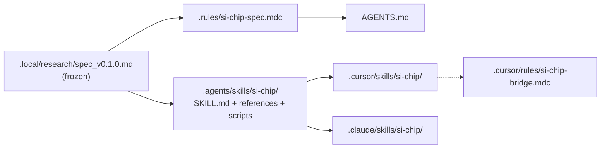
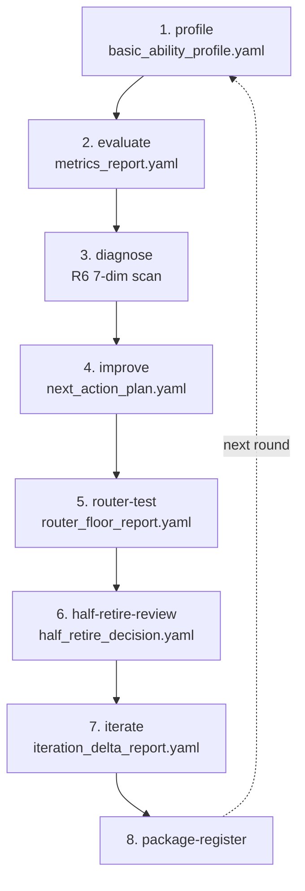
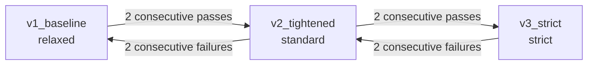
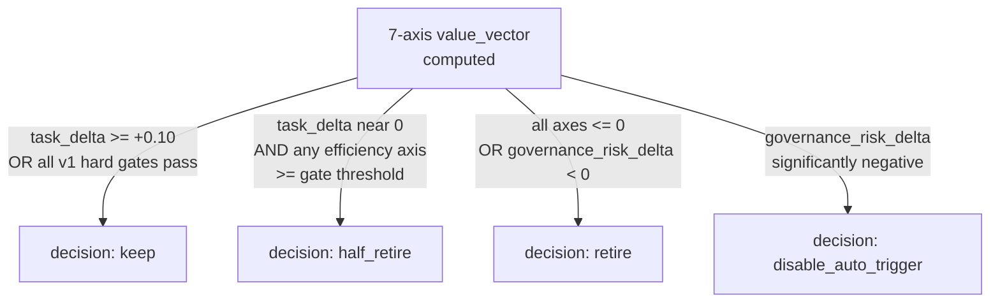
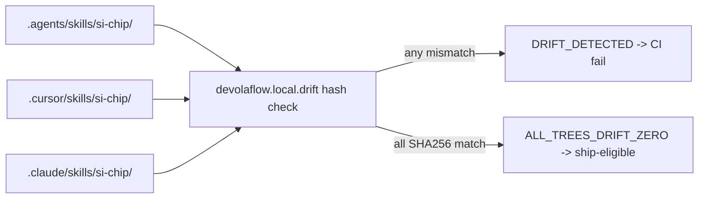

# Architecture

# 架构

// CHAPTER 01 //

## 1. Source-of-truth and platform mirrors

The skill payload is mirrored from a single canonical source into the two
runtime platform trees, plus a derived release tarball that the one-line
installer consumes.

## 1. 源头与平台镜像

技能负载从单一规范源头镜像到两个运行时平台目录树，外加一个由 install.sh
一键安装脚本所消费的衍生发布 tarball。

// CHAPTER 02 //

## 2. Dogfood loop (spec section 8.1 Frozen Order)

Each dogfood round walks the 8 frozen steps in order; the package-register
step closes the loop and feeds the next round's profile step.

## 2. Dogfood 循环（规范 §8.1 冻结顺序）

每一轮 dogfood 都按顺序走完 8 个冻结步骤；package-register 步骤完成闭环，
并为下一轮的 profile 步骤提供输入。

// CHAPTER 03 //

## 3. Three progressive gate profiles

Promotion requires 2 consecutive passes at the current gate; demotion is
triggered by 2 consecutive failures. v0.1.0 ships at `v1_baseline` (relaxed).

## 3. 三档渐进 gate profile

升档需要在当前 gate 连续两轮通过；降档由连续两轮失败触发。v0.1.0 在
`v1_baseline`（relaxed）档位交付。

// CHAPTER 04 //

## 4. Decision tree for half-retirement (spec section 6.2)

The 7-axis value_vector is computed every round. The decision branches on
`task_delta`, the efficiency axes, and `governance_risk_delta`.

## 4. 半退役决策树（规范 §6.2）

每一轮都会计算 7 维 value_vector。决策分支由 `task_delta`、各效率维度以及
`governance_risk_delta` 共同决定。

// CHAPTER 05 //

## 5. Cross-tree drift contract (zero drift required)

Every ship-eligible commit must satisfy `ALL_TREES_DRIFT_ZERO`: the
`devolaflow.local.drift` hash check compares SHA256 across the source-of-truth
and the two platform mirrors. Any mismatch fails CI.

## 5. 跨树漂移契约（要求零漂移）

任何具备 ship 资格的提交都必须满足 `ALL_TREES_DRIFT_ZERO`：
`devolaflow.local.drift` 哈希检查会在源头与两个平台镜像之间比对 SHA256。
任意不匹配都会让 CI 失败。

> Mermaid lint compliance: every node id is camelCase / snake_case (no spaces);
> labels with quoted text use double quotes; no reserved keywords as ids.

> Mermaid 规范遵从：每个节点 id 都使用 camelCase / snake_case（不含空格）；
> 含引号文本的 label 使用双引号；不使用保留字作为 id。

