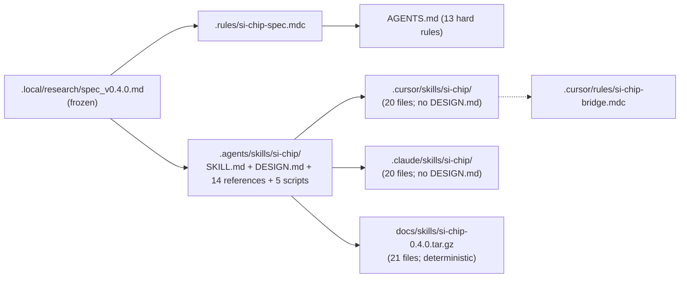
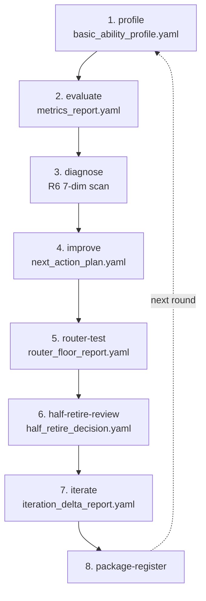
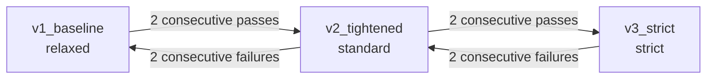
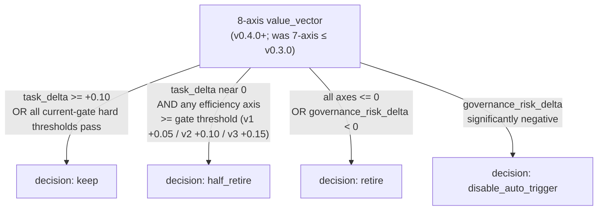
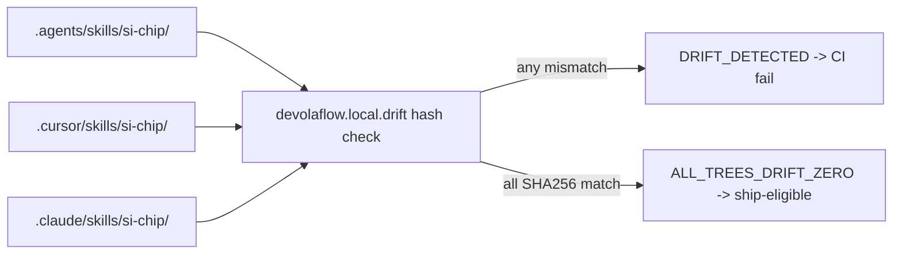

// CHAPTER 01 //

## 1. Source-of-truth and platform mirrors

The skill payload is mirrored from a single canonical source into the two
runtime platform trees, plus a derived release tarball that the one-line
installer consumes.

## 1. 源头与平台镜像

技能负载从单一规范源头镜像到两个运行时平台目录树，外加一个由 install.sh
一键安装脚本所消费的衍生发布 tarball。

// CHAPTER 02 //

## 2. Dogfood loop (spec section 8.1 Frozen Order)

Each dogfood round walks the 8 frozen steps in order; the package-register
step closes the loop and feeds the next round's profile step.

## 2. Dogfood 循环（规范 §8.1 冻结顺序）

每一轮 dogfood 都按顺序走完 8 个冻结步骤；package-register 步骤完成闭环，
并为下一轮的 profile 步骤提供输入。

// CHAPTER 03 //

## 3. Three progressive gate profiles

Promotion requires 2 consecutive passes at the current gate; demotion is
triggered by 2 consecutive failures. v0.1.0 — v0.3.0 shipped at `v1_baseline`
(`relaxed`); **v0.4.0 is the FIRST Si-Chip release at `v2_tightened`
(`standard`)** after 19 consecutive `v1_baseline` rounds and 2 consecutive
`v2_tightened` rounds (Round 18 + Round 19); `v3_strict` (`strict`) is
deferred to v0.4.x.

## 3. 三档渐进 gate profile

升档需要在当前 gate 连续两轮通过；降档由连续两轮失败触发。v0.1.0 — v0.3.0
均在 `v1_baseline`（`relaxed`）档位交付；**v0.4.0 是 Si-Chip 首次在
`v2_tightened`（`standard`）档位发版**——前置 19 轮连续 `v1_baseline` + 2 轮连续
`v2_tightened`（Round 18 + Round 19）；`v3_strict`（`strict`）已延后到 v0.4.x。

// CHAPTER 04 //

## 4. Decision tree for half-retirement (spec section 6.2)

The **8-axis** value_vector (v0.4.0+; v0.1.0 — v0.3.0 used 7 axes — the 8th
`eager_token_delta` was added per the Q4 user decision and is the FIRST
byte-identicality break of §6.1) is computed every round. The decision
branches on `task_delta`, the efficiency axes, and `governance_risk_delta`.

## 4. 半退役决策树（规范 §6.2）

每一轮都会计算 **8 维** value_vector（v0.4.0+；v0.1.0 — v0.3.0 为 7 维——按 Q4
用户决策新增第 8 维 `eager_token_delta`，这是 §6.1 自 v0.1.0 以来首次破坏字节
一致性）。决策分支由 `task_delta`、各效率维度以及 `governance_risk_delta` 共同决定。

// CHAPTER 05 //

## 5. Cross-tree drift contract (zero drift required)

Every ship-eligible commit must satisfy `ALL_TREES_DRIFT_ZERO`: the
`devolaflow.local.drift` hash check compares SHA256 across the source-of-truth
and the two platform mirrors. Any mismatch fails CI.

## 5. 跨树漂移契约（要求零漂移）

任何具备 ship 资格的提交都必须满足 `ALL_TREES_DRIFT_ZERO`：
`devolaflow.local.drift` 哈希检查会在源头与两个平台镜像之间比对 SHA256。
任意不匹配都会让 CI 失败。

> Mermaid lint compliance: every node id is camelCase / snake_case (no spaces);
> labels with quoted text use double quotes; no reserved keywords as ids.

> Mermaid 规范遵从：每个节点 id 都使用 camelCase / snake_case（不含空格）；
> 含引号文本的 label 使用双引号；不使用保留字作为 id。

// CHAPTER 06 //

## 6. v0.3.0 + v0.4.0 invariant add-ons (top-level, beside `metrics`)

`metrics_report.yaml` at v0.4.0 grows beyond R6's 7 × 37 keys with three
**top-level** invariants — explicitly NOT inside R6 D2 (the v0.4.0 spec
clarifies this in §18.1):

| Block | Spec | Purpose |
|---|---|---|
| `core_goal { C0_core_goal_pass_rate }` | §14 (v0.3.0) | MUST = 1.0 every round; round failure if < 1.0 regardless of R6 axes; REVERT-only response per §14.4 |
| `token_tier { C7_eager_per_session, C8_oncall_per_trigger, C9_lazy_avg_per_load }` | §18 (v0.4.0) | EAGER / ON-CALL / LAZY token decomposition; OPTIONAL EAGER-weighted iteration_delta; spec_validator BLOCKER 12 |
| `promotion_state { current_gate, consecutive_passes, ... }` | §20 (v0.4.0) | first-class top-level block on `metrics_report.yaml`; mirrors `lifecycle.promotion_history` append-only audit trail |

Three additional v0.4.0 BLOCKERs round out the 14-invariant validator:
`REAL_DATA_FIXTURE_PROVENANCE` (§19), `HEALTH_SMOKE_DECLARED_WHEN_LIVE_BACKEND`
(§21), and the v0.3.0 pair `CORE_GOAL_FIELD_PRESENT` (§14) +
`ROUND_KIND_TEMPLATE_VALID` (§15). All 14 BLOCKERs are documented in
`tools/spec_validator.py --help` and listed in
[USERGUIDE.md §5](./userguide/#5-running-the-spec-validator).

## 6. v0.3.0 + v0.4.0 不变量增量（顶层，与 `metrics` 平级）

v0.4.0 的 `metrics_report.yaml` 在 R6 的 7 × 37 个 key 之外，新增了三个
**顶层**不变量——明确**不在** R6 D2 内（v0.4.0 规范在 §18.1 中专门澄清）：

| 块 | 规范 | 作用 |
|---|---|---|
| `core_goal { C0_core_goal_pass_rate }` | §14（v0.3.0） | 每轮 MUST = 1.0；< 1.0 则整轮失败，与 R6 维度无关；按 §14.4 触发 REVERT-only |
| `token_tier { C7_eager_per_session, C8_oncall_per_trigger, C9_lazy_avg_per_load }` | §18（v0.4.0） | EAGER / ON-CALL / LAZY token 三层分解；可选的 EAGER 加权 iteration_delta；spec_validator BLOCKER 12 |
| `promotion_state { current_gate, consecutive_passes, ... }` | §20（v0.4.0） | `metrics_report.yaml` 上的一等顶层块；与 `lifecycle.promotion_history` 仅可追加的审计链对应 |

v0.4.0 还新增了 3 条 BLOCKER 把校验器拉到 14 条：`REAL_DATA_FIXTURE_PROVENANCE`（§19）、
`HEALTH_SMOKE_DECLARED_WHEN_LIVE_BACKEND`（§21），加上 v0.3.0 的两条
`CORE_GOAL_FIELD_PRESENT`（§14）与 `ROUND_KIND_TEMPLATE_VALID`（§15）。完整 14 条
BLOCKER 记录在 `tools/spec_validator.py --help` 中，并在
[USERGUIDE.md §5](./userguide/#5-running-the-spec-validator) 列出。

