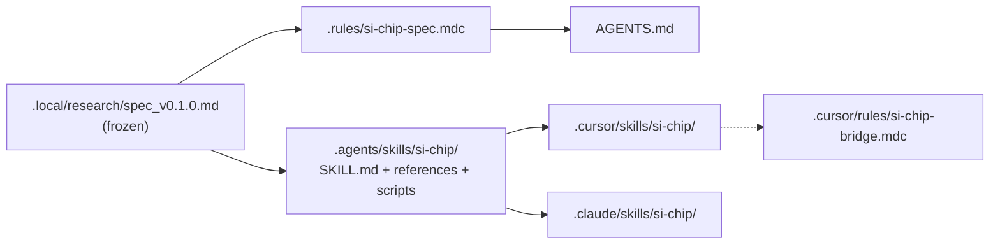
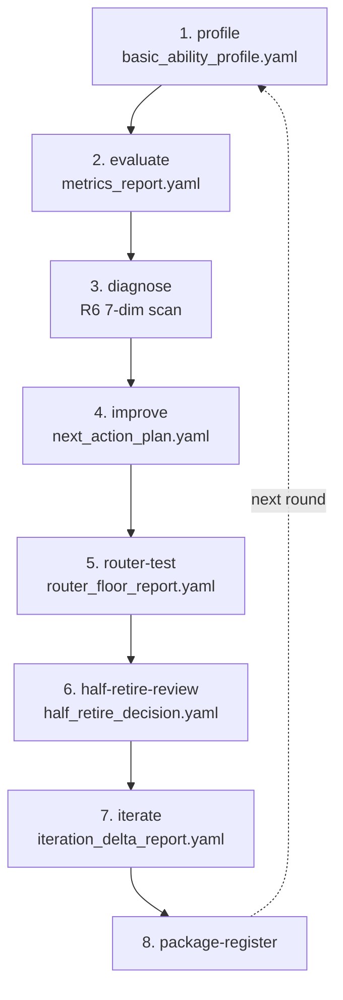
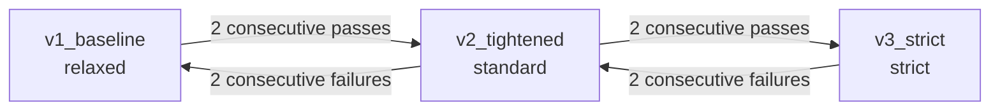
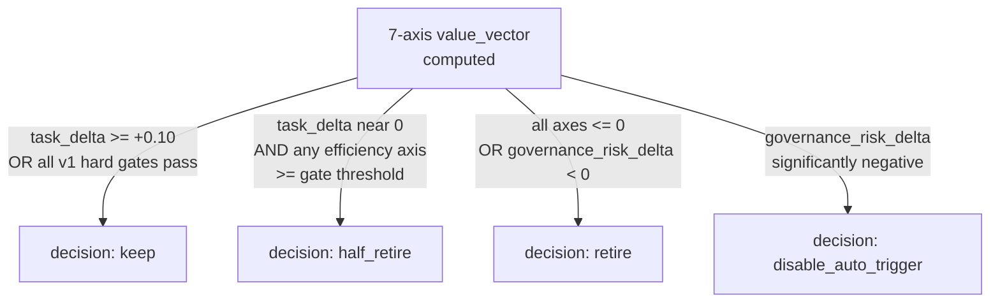
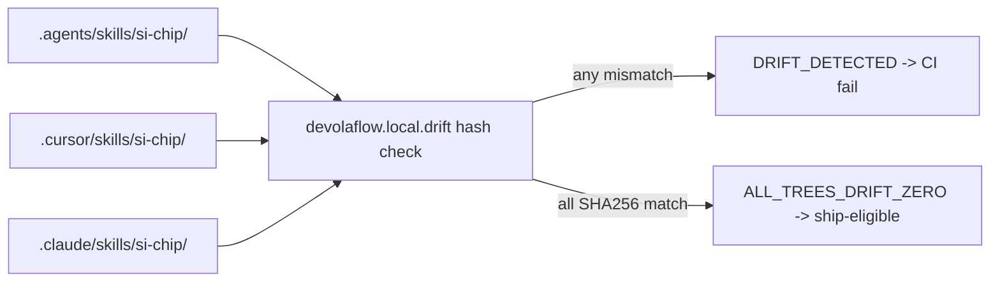

# Architecture

## 1. Source-of-truth and platform mirrors

## 2. Dogfood loop (spec section 8.1 Frozen Order)

## 3. Three progressive gate profiles

## 4. Decision tree for half-retirement (spec section 6.2)

## 5. Cross-tree drift contract (zero drift required)

> Mermaid lint compliance: every node id is camelCase / snake_case (no spaces);
> labels with quoted text use double quotes; no reserved keywords as ids.
