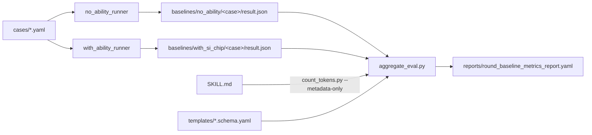

# Si-Chip Baseline Smoke Report

- **Task**: S3.W3.C — metrics bridge wiring + smoke test
- **Round**: `round_baseline` (pre-dogfood; proves pipeline health)
- **Date (UTC)**: 2026-04-28
- **Spec section**: v0.1.0 §3 (R6 metrics) / §8.1 step 2 / §8.2 evidence #2

## Pipeline Diagram



Flow: `cases → no_ability_runner & with_ability_runner → per-case result.json → aggregate_eval.py (+count_tokens.py, +schema cross-check) → metrics_report.yaml`.

## Headline Numbers (MVP-8)

| Key | Value | Source |
|---|---|---|
| T1_pass_rate | 0.85 | mean(pass_rate) over 6 with-ability runs |
| T2_pass_k (k=4) | 0.5478 | mean(pass_k_4) over 6 with-ability runs |
| T3_baseline_delta | +0.35 | T1_with (0.85) - T1_without (0.50) |
| C1_metadata_tokens | 78 | SKILL.md via count_tokens.py --metadata-only |
| C4_per_invocation_footprint | 4071 | mean(per_invocation_footprint) |
| L2_wall_clock_p95 (s) | 1.469 | mean(latency_p95_s) |
| R3_trigger_F1 | 0.8934 | mean(trigger_F1) |
| R5_router_floor | composer_2/fast | unique value across runs |

## R6 Schema Coverage

- Dimensions present: 7/7 (`task_quality, context_economy, latency_path, generalizability, usage_cost, routing_cost, governance_risk`)
- Sub-metric keys present: 37 total (per_dim: D1=4, D2=6, D3=7, D4=4, D5=4, D6=8, D7=4) — exceeds spec §3.2 `>= 28` constraint.
- Populated (non-null): 8 (MVP-8 set, exactly as frozen constraint #2 requires)
- Null placeholders: 29 (all non-MVP-8 keys carry explicit `null`, not omitted)
- Naming convention: **prefixed form** (`T1_pass_rate`, `C4_per_invocation_footprint`, `R5_router_floor`, ...). Matches `templates/basic_ability_profile.schema.yaml`.

## Spec Validator Verdict (post-stage)

```
$ python tools/spec_validator.py --json
verdict = PASS, failed = []
exit_code = 0
```

No regression introduced by W3.C.

## Known Limitations

- **Simulated baselines**: per W3.B runner docstrings, both `no_ability_runner` and `with_ability_runner` produce deterministic seeded outcomes (seed=42) rather than invoking a real LLM. They correctly exercise the metrics bridge but do not reflect true task performance.
- **Upgrade path**: swap runners for LLM-backed implementations (OTel `gen_ai.*` spans per §3.2 constraint #3). The aggregate_eval.py contract is stable; only the runner needs replacing.
- **Cross-check soft-warn**: aggregate_eval.py emits `schema lacks 'basic_ability.metrics' mapping` because the template is JSON-Schema-shaped (`properties.basic_ability.properties.metrics.properties`), not a direct `basic_ability.metrics` map. This is a non-blocking warning; MVP-8 population is verified separately.
